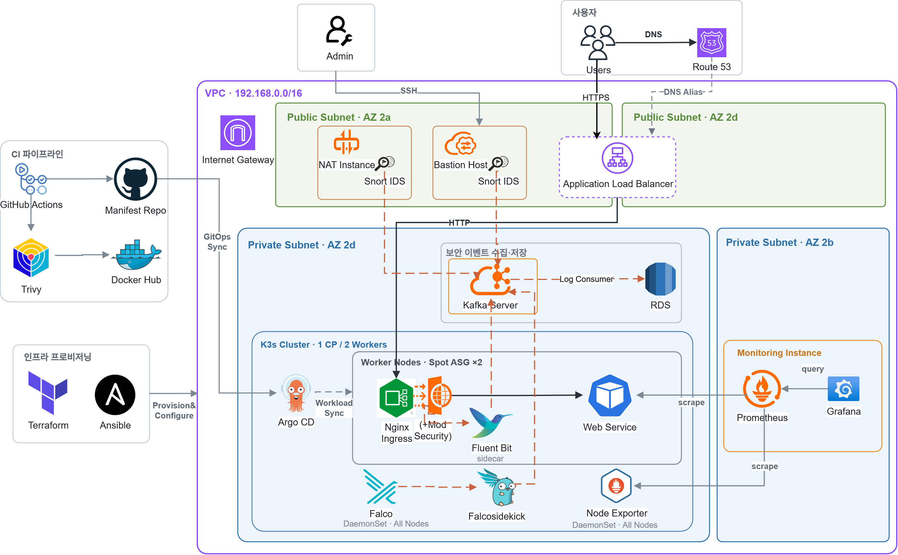

# 통합 보안 플랫폼 — K3s 운영 환경 · Argo CD GitOps 배포

> [!NOTE]
> ## About this Repository
> 이 저장소는 kt cloud 클라우드 인프라 부트캠프 2기 심화 프로젝트 `오픈소스 기반 클라우드 네이티브 통합 보안 플랫폼`에서 담당한 **K3s 운영 환경 구성, Kubernetes 워크로드 설정, Argo CD 기반 GitOps 배포**를 정리한 포트폴리오 레포지토리입니다.
>
> 프로젝트에서는 K3s 구성을 보완하고, Kubernetes 워크로드 운영 설정과 Argo CD 기반 GitOps 배포, private repository 인증, 보안 이벤트·메트릭 수집 경로를 구성했습니다. 이미지 빌드부터 GitOps 배포까지의 CI 연계 과정도 함께 정리했습니다.



## 프로젝트 담당 범위

- **K3s 구성 보완**: Worker ASG, `k3s_token`, control-plane Ansible, 노드 통신 설정을 보완하고 1 CP / 2 Worker 구성 확인
- **Kubernetes · GitOps**: bootstrap 리소스, `ingress-nginx`, `node-exporter`, `Falco`, `doc-converter` 매니페스트 구성, Argo CD GitOps·Sync Wave 적용
- **보안 이벤트·메트릭 수집**: `ModSecurity`, `Falco` 이벤트를 `kafka.logging`으로 전달, `node-exporter`와 앱 메트릭을 외부 Prometheus 수집 대상으로 구성
- **CI 연계 (팀 공동 작업)**: `GitHub Actions`에서 `doc-converter` 이미지 빌드, Trivy 스캔, Docker Hub push, Kustomize 이미지 태그 갱신

## 배포 방식 전환

초기에는 Manifest를 의존 순서에 따라 직접 적용했습니다. 반복 배포와 설정 누락을 줄이기 위해 Argo CD 기반 GitOps로 전환하고, 구성요소를 Application으로 분리해 Sync Wave를 Git에 선언했습니다.

## 구현 결과

- 수동 Manifest 적용을 Argo CD의 Git 기반 Sync로 전환
- Argo CD Application과 Sync Wave로 `ingress-nginx`/`node-exporter` → `Falco` → `doc-converter` Application 적용 순서 관리
- GitHub App 기반 private repo 인증 구성, SSM Parameter Store → External Secrets로 자격정보 주입
- `doc-converter`에 Pod 분산, Probe, HPA, create-first rolling update 정책 적용
- `ModSecurity` 감사 로그와 `Falco` 이벤트를 Kafka Server로 전달하고, 노드/앱 메트릭을 Prometheus 수집 대상으로 구성

## 주요 설계 결정

### CI · 배포 파이프라인

- **CI에서는 빌드부터 매니페스트 갱신까지 처리합니다.**  
  `doc-converter` 이미지 빌드 → `Trivy` 취약점 스캔 → `CRITICAL` 발견 시 워크플로 중단 → Docker Hub push → Kustomize 이미지 태그 갱신 순서로 실행됩니다.

- **이미지 버전을 GitOps 상태와 연결했습니다.**  
  CI에서 이미지를 `github.sha`로 태깅하고 Kustomize `newTag`를 함께 갱신해, Git 이력에서 배포 이미지 버전을 확인할 수 있도록 했습니다.

### 클러스터 구성 순서

- **선행 리소스 의존관계에 맞춰 bootstrap 적용 순서를 정리했습니다.**  
  `namespace → External Secrets → Argo CD → bootstrap 입력 리소스 → root-app` 순서로 적용해 선행 리소스 누락으로 Sync가 실패하지 않도록 했습니다.

- **Bootstrap 재실행 시 기존 상태와 실패 지점을 확인할 수 있게 구성했습니다.**  
  필요한 입력 파일을 먼저 검증하고, External Secrets·Argo CD·repo Secret 준비 상태를 확인한 뒤 다음 단계로 진행합니다. 준비가 지연되면 timeout과 관련 리소스 상태를 출력합니다.

- **Argo CD child Application 적용 순서를 Sync Wave로 관리했습니다.**  
  각 Application에 Sync Wave annotation을 지정해 `ingress-nginx`/`node-exporter` → `Falco` → `doc-converter` 순서로 Application 리소스가 적용되도록 했습니다.

- **Helm 기반 구성요소는 values가 chart보다 먼저 적용되도록 했습니다.**  
  `ingress-nginx`와 `Falco`의 `HelmChartConfig`에 `HelmChart`보다 앞선 Sync Wave를 지정했습니다. 보안·로그 설정이 반영되지 않은 기본값으로 Chart가 설치되는 것을 방지했습니다.

### 보안

- **프로젝트 당시 private repository 인증에 GitHub App을 사용했습니다.**  
  SSH deploy key, PAT 대신 GitHub App을 선택했습니다. GitHub App의 private key를 이용해 필요 시 수명이 짧은 installation access token을 발급받도록 구성했습니다. 자격정보는 AWS SSM Parameter Store에 두고 External Secrets Operator로 주입해, 민감 정보를 Git에 올리지 않습니다.

- **AWS 접근에는 Access Key 대신 노드 IAM Role을 사용했습니다.**  
  control-plane의 IAM Role은 Argo CD 자격정보 조회에, worker의 IAM Role은 `doc-converter`의 S3 접근에 사용했습니다. Access Key를 Kubernetes Secret에 저장하지 않도록 구성했습니다.

- **Kafka Server 주소를 수집 설정과 분리했습니다.**  
  `ModSecurity`와 `Falco`는 `kafka.logging`을 통해 Kafka에 접근하고, 실제 Kafka Server 주소는 `Service/EndpointSlice`에서 관리하도록 구성했습니다.

### 앱 운영

- **공통 리소스와 환경별 설정을 Kustomize base/overlay로 분리했습니다.**  
  `Deployment`, `Service`, `Ingress`, `HPA`는 base에서 관리하고, dev 환경의 resource·toleration·runtime info·image tag·metrics NodePort는 overlay에서 별도로 적용했습니다. 환경별 차이만 overlay에서 관리해 공통 리소스 정의가 중복되지 않도록 했습니다.

- **Pod 분산·Probe·Rolling Update 정책을 배포 설정에 반영했습니다.**  
  anti-affinity와 topology spread로 worker 간 분산을 유도하고, startup/readiness/liveness probe와 `maxUnavailable: 0` / `maxSurge: 1` rolling update를 적용했습니다. Pod 종료 시에는 `preStop`과 termination grace period를 두었습니다.

- **외부 Prometheus 수집 경로를 구성했습니다.**  
  `node-exporter`를 DaemonSet으로 배치해 외부 Prometheus가 노드 메트릭을 수집하도록 구성했습니다.

## 요청/이벤트/메트릭 경로

### 서비스 트래픽

```
ALB → worker NodePort → ingress-nginx → Service → Pod
```

`ingress-nginx`는 worker 노드에 `DaemonSet`으로 배치하며, NodePort는 HTTP `30080` / HTTPS `30443`을 사용합니다.

`doc-converter` 연결 경로:

- Ingress: `/`
- Service: `apps/doc-converter`
- Pod port: `8000`

### 보안 이벤트와 메트릭

#### ModSecurity audit log

```
Ingress Request → ModSecurity 검사 → audit log 생성 → fluent-bit-sidecar → kafka.logging → Kafka Server
```

- `ingress-nginx` controller에 ModSecurity를 활성화했습니다.
- audit log는 `/var/log/audit/modsec_audit.log`에 기록됩니다.
- 같은 Pod의 `fluent-bit-sidecar`가 이 로그를 tail해 `kafka.logging.svc.cluster.local:9092`로 전달합니다.

#### Falco 이벤트

```
Node Runtime Event → Falco → Falcosidekick → kafka.logging → Kafka Server
```

#### 노드/앱 메트릭

- 노드 메트릭: `<node-private-ip>:9100` (node-exporter DaemonSet, `hostNetwork: true`)
- 앱 메트릭: `<worker-node-ip>:30081/metrics` (doc-converter metrics NodePort)

## Repository Layout

```text
.
├── .github/workflows/ci.yml          # doc-converter CI/CD workflow
├── assets/                           # architecture images
├── cluster/
│   ├── bootstrap/                    # namespace, External Secrets, Argo CD bootstrap
│   ├── argocd/                       # root app and child Applications
│   ├── manifests/                    # ingress-nginx, Falco, node-exporter
│   ├── workloads/                    # doc-converter workload manifests
│   └── references/bootstrap-inputs/   # environment-specific bootstrap inputs
└── ops-scripts/                      # bootstrap and operational scripts
```

현재 문서는 `doc-converter` 배포 구성을 기준으로 설명합니다.

`doc-converter` 기준 파일 위치:

- Kubernetes 리소스: `cluster/workloads/apps/doc-converter`
- 이미지 참조: `cluster/workloads/apps/doc-converter/overlays/dev/kustomization.yaml`
- Argo CD app: `cluster/argocd/applications/apps/doc-converter-dev.yaml`

## 구현 상세

### Bootstrap 순서

```
1.  00-namespaces.yaml
2.  External Secrets values
3.  External Secrets helmchart
4.  ClusterSecretStore
5.  argocd-root-repo ExternalSecret
6.  Argo CD values
7.  Argo CD helmchart
8.  doc-converter-configmap.input.yaml
9.  kafka-alias.yaml
10. root-app
```

`ops-scripts/bootstrap-argocd-after-k3s.sh`도 같은 순서를 따르는 보조 스크립트입니다.

각 단계가 필요한 이유:

- namespaced resource를 apply하려면 namespace가 먼저 있어야 합니다.
- `HelmChartConfig(values)`가 `HelmChart`보다 먼저 적용돼야 원하는 설정으로 처음부터 설치됩니다.
- Argo CD가 repo를 읽으려면 `argocd-root-repo` Secret이 먼저 준비돼 있어야 합니다.
- `doc-converter-config`는 `doc-converter` Pod보다 먼저 있어야 합니다.
- `kafka-alias`는 `ingress-nginx` sidecar와 `Falco`가 참조하는 이름이므로, child app Sync 전에 준비돼 있어야 합니다.
- `root-app`은 마지막에 apply해야 child app들이 선행 리소스를 볼 수 있습니다.

### HelmChart 리소스 순서 제어

`ingress-nginx`와 `falco`는 `HelmChartConfig + HelmChart` 구조를 사용합니다. values가 chart보다 먼저 적용돼야 하므로 Sync Wave로 순서를 분리했습니다.

- `HelmChartConfig`와 선행 `ConfigMap`: `sync-wave: "-1"`
- `HelmChart`: `sync-wave: "0"`

관련 파일:

- `cluster/manifests/ingress-nginx/values.yaml`
- `cluster/manifests/ingress-nginx/modsecurity-audit-sidecar-config.yaml`
- `cluster/manifests/ingress-nginx/helmchart.yaml`
- `cluster/manifests/falco/values.yaml`
- `cluster/manifests/falco/helmchart.yaml`

### Argo CD Sync Wave 설계

`ingress-nginx`, `node-exporter`, `Falco`, `doc-converter`를 개별 Application으로 분리하고, 구성요소 간 의존성과 적용 순서에 맞춰 Sync Wave를 지정했습니다.

| Wave | Application | 배치 기준 |
|------|-------------|-----------|
| 1 | `ingress-nginx`, `node-exporter` | 외부 트래픽·기본 관측 구성 |
| 2 | `falco` | 런타임 보안 구성 |
| 3 | `doc-converter-dev` | 공통 인프라·보안 구성 이후 앱 적용 |

같은 Sync Wave의 Application은 같은 단계에서 적용됩니다.

### CI/CD 연결

GitHub Actions 워크플로우 트리거 (프로젝트 당시 앱 소스 경로 기준):

- branch: `main`
- path: `app/doc-converter/**`, `.github/workflows/ci.yml`

워크플로우 단계:

1. `doc-converter` Docker image build
2. Trivy 취약점 스캔 (`CRITICAL` 발견 시 중단)
3. Docker Hub에 `latest`와 `github.sha` 태그로 push
4. `cluster/workloads/apps/doc-converter/overlays/dev/kustomization.yaml` 이미지 태그를 `github.sha`로 갱신
5. 수정된 `kustomization.yaml`을 commit/push

배포 순서:

```
doc-converter 코드 변경 → GitHub Actions build/push → overlay image tag 갱신 → Argo CD가 Git 변경 감지 → 앱 배포
```

필요한 GitHub Actions Secrets:

- `DOCKERHUB_USERNAME`
- `DOCKERHUB_TOKEN`

### 앱 설정 (doc-converter)

#### 기본 정보

`doc-converter`는 문서 파일을 변환해 S3에 업로드하는 FastAPI 기반 내부 서비스입니다.

- 런타임: FastAPI
- 컨테이너 포트: `8000`
- endpoint: `/`, `/health`, `/ready`, `/metrics`
- 사용 환경변수: `S3_BUCKET_NAME`

#### Kubernetes 리소스

- **Deployment**: worker node 스케줄, anti-affinity + topology spread, `doc-converter-config` ConfigMap 주입, startup/readiness/liveness probe, `maxUnavailable: 0` / `maxSurge: 1`의 create-first rolling update
- **Service**: port `80 → 8000`
- **Ingress**: `/` 경로
- **HPA**: minReplicas `2`, maxReplicas `4`, CPU target `60%`
- **dev overlay**: 이미지 이름/태그, 리소스 request/limit, dead node toleration, runtime info env, metrics NodePort `30081`

현재 기본 이미지 설정:

```yaml
images:
  - name: doc-converter-image
    newName: z33hyo/doc-converter
    newTag: "0.4"
```

CI가 실행될 때마다 `newTag`는 `github.sha`로 갱신됩니다.

## 재현 가이드

### 다른 환경에서 사용할 때

#### Docker Hub 이미지 이름

`cluster/workloads/apps/doc-converter/overlays/dev/kustomization.yaml`의 `newName`을 수정합니다.

```yaml
images:
  - name: doc-converter-image
    newName: <your-dockerhub-username>/doc-converter
```

`ci.yml`은 `DOCKERHUB_USERNAME` secret을 참조하므로 그대로 둬도 됩니다.

#### GitHub repo URL

Argo CD가 바라보는 `repoURL`을 아래 파일에서 수정합니다.

- `cluster/argocd/applications/root.yaml`
- `cluster/argocd/applications/apps/*.yaml`
- `cluster/bootstrap/external-secrets/argocd-root-repo.externalsecret.yaml`

### Bootstrap 전 실제값 설정

#### 1. `doc-converter-configmap.input.yaml`

예시 파일을 복사해 실제값을 채웁니다.

- 예시: `cluster/references/bootstrap-inputs/doc-converter-configmap.input.yaml.example`
- 적용: `cluster/references/bootstrap-inputs/doc-converter-configmap.input.yaml`

```yaml
data:
  S3_BUCKET_NAME: <your-s3-bucket-name>
```

`doc-converter`는 `S3_BUCKET_NAME`을 환경변수로 읽고, readiness probe도 이 값을 확인합니다.

#### 2. `kafka-alias.yaml`

K3s 외부 Kafka Server가 먼저 준비돼 있어야 합니다. 보안 로그(ModSecurity, Falco)가 이 Kafka로 전달됩니다.

경로: `cluster/references/bootstrap-inputs/kafka-alias.yaml`

```yaml
endpoints:
  - addresses:
      - <your-external-kafka-private-ip>  # 예: 192.168.x.x
```

이 값을 수정하지 않으면 `ingress-nginx` ModSecurity sidecar와 `Falcosidekick`이 Kafka를 찾지 못합니다.

#### 3. Argo CD 레포지토리 자격정보

Argo CD가 private repo를 읽으려면 GitHub App 자격정보가 필요합니다.

먼저 다음을 준비합니다.

1. 대상 organization 또는 계정에 GitHub App 생성 (권한: `Contents: Read`)
2. 대상 repo에 App 설치
3. 발급된 `app-id`, `installation-id`, `private-key`를 AWS SSM Parameter Store에 저장

`cluster/bootstrap/external-secrets/argocd-root-repo.externalsecret.yaml`은 Parameter Store의 아래 키를 참조합니다.

- `/sixsense/argocd/github-app/app-id`
- `/sixsense/argocd/github-app/installation-id`
- `/sixsense/argocd/github-app/private-key`

bootstrap을 그대로 사용하려면 다음도 준비돼 있어야 합니다.

- control-plane에서 AWS SSM Parameter Store를 읽을 수 있는 IAM 권한
- 위 3개의 Parameter Store 값

### Bootstrap 방법

프로젝트에서는 K3s 설치 후 아래 순서로 Kubernetes·GitOps bootstrap을 진행했습니다. 이 레포지토리에서는 동일한 bootstrap 순서를 `ops-scripts/bootstrap-argocd-after-k3s.sh`로 재현할 수 있습니다.

전제 조건:

- K3s가 설치돼 있고 `kubectl`로 클러스터에 접근 가능
- `cluster/references/bootstrap-inputs/doc-converter-configmap.input.yaml`에 실제 `S3_BUCKET_NAME` 입력 완료
- `cluster/references/bootstrap-inputs/kafka-alias.yaml`에 실제 Kafka IP 입력 완료
- ExternalSecret 방식을 그대로 사용한다면 AWS SSM Parameter Store와 IAM 권한까지 준비 완료

```bash
bash ops-scripts/bootstrap-argocd-after-k3s.sh
```

## Future Work

### Node lifecycle

- `AWS Node Termination Handler`를 Spot interruption·예정된 종료·ASG scale-in 이벤트와 연동해 worker node `cordon/drain` 자동화
- 기존 cleanup 스크립트를 AWS EC2 상태 확인과 연동해 종료된 인스턴스에 대응하는 stale `NotReady` Node 정리 자동화
- 노드 리소스 여유가 확보되면 `descheduler`를 도입해 장애 복구 후 편중된 Pod의 재배치를 유도

### HA · Scaling

- `Cluster Autoscaler`를 Worker ASG와 연동해 Pending Pod 발생 시 Worker 확장, 유휴 Node 축소
- 단일 control-plane 구조를 multi control-plane K3s HA 구성으로 확장

### IAM · CI

- K3s ServiceAccount OIDC issuer를 AWS IAM과 연동해 Pod 단위 권한 분리 검토
- 앱 이미지 CI와 별도로 Argo CD/Kustomize manifest 변경에 대한 검증 CI 추가
